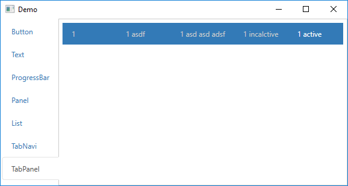

# WPF.Bootstrap
A Bootstrap Theme for WPF

 

## How to Use

`Install-Package Bootstrap.Wpf`

Put the following code in your App.xaml or MainWindow.xaml or any other window which use the resourse, for example, in `App.xaml`

    <Application.Resources>
        <ResourceDictionary>
            <ResourceDictionary.MergedDictionaries>
                <ResourceDictionary Source="/WPF.Bootstrap;component/Themes/Default.xaml"/>
            </ResourceDictionary.MergedDictionaries>
        </ResourceDictionary>
    </Application.Resources>
    
Now you can use the controls, for example:

        <bootstrap:BootstrapPanel Margin="10" Type="Default" Header="Default Panel">
            <TextBlock>content</TextBlock>
            <bootstrap:BootstrapPanel.Footer>
                <TextBlock>footer</TextBlock>
            </bootstrap:BootstrapPanel.Footer>
        </bootstrap:BootstrapPanel>
        
Remember to add `xmlns:bootstrap="http://github.com/scheshan/bootstrap"`

## Use Wpf.Bootstrap in a WPF User Control Library (.dll) project

If the solution contains one .exe project and several other WPF User Control Library (.dll) projects, the Wpf.Bootstrap package should be added to both the .dll projects and the exe project, even if the .exe project does not use Wpf.Bootstrap directly.

## Project History

This project originally is a fork from [scheshan/WPF.Bootstrap](https://github.com/scheshan/WPF.Bootstrap). This project uses a different nuget pakcage id: `Bootstrap.Wpf`. (Could you see the difference?)

## Revision History

### v0.0.4:

Added TabPanel:

You can use TabPanel alone with as a navigation control. You don't need to bind it to tab content.

### v0.0.3:

1)Remove dependency of Microsoft.windows.shell

After the removal of above dependencies, the dialog/window stype will be managed by the OS (Win7 or Win10). Thereafter this project will mainly focus on the style/theme of content of window or controls.
